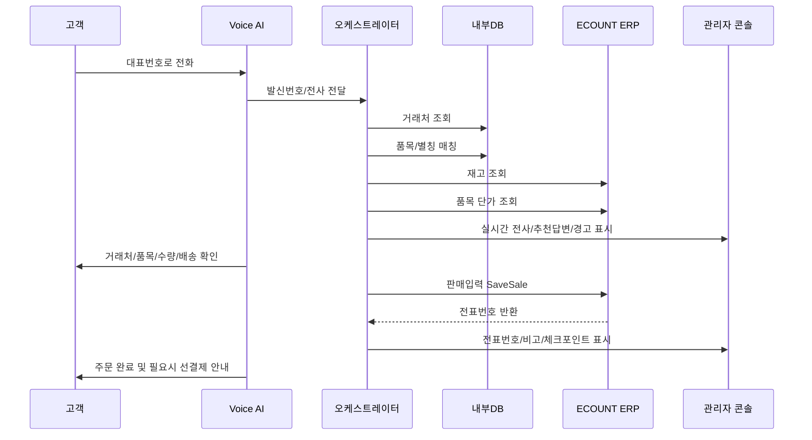
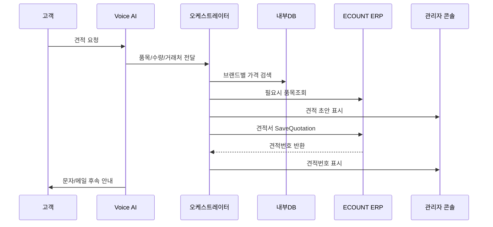

# AICC 1차 설계안

## 1. 확정 정책

### 1.1 기본 운영

- 대표번호: `02-717-3386` 유지
- 근무시간: 평일 `10:00~17:00`
- 야간/주말: AI 안내 멘트 후 자동응대
- 1차 오픈 범위: `주문 + 재고 + 제한적 견적 + 기술문의 보조`
- 초기 2주: `AI 응대 + 사람 실시간 감시/개입`

### 1.2 창고/담당자

- 용산창고 `WH_CD=10`
- 김포창고 `WH_CD=30`
- 기본 담당자 `EMP_CD=01`

### 1.3 가격 정책

#### ERP/LANstar

- 기존 거래처: `OUT_PRICE1`
- 신규 거래처: `OUT_PRICE2`

#### 타사 브랜드

- 원칙: `노출가 / 지도가 / 온라인등록가` 계열을 견적가로 사용
- ipTIME: `G열` 기준
- NEXT: `무료배송` 기준
- NEXI: `온라인등록가` 기준

### 1.4 배송 정책

- 기본 비고/적요는 통화 내용에서 확정된 배송방법 저장
- 표준 배송값:
  - `배송`
  - `방문수령`
  - `택배-로젠`
  - `택배-경동택배`
  - `택배-경동화물`
  - `퀵`

### 1.5 선결제 정책

- 선입금업체도 판매입력 전표는 생성
- 통화 말미 안내 문구:
  - `먼저 선결제해주셔야 당일 출고 가능합니다.`
- 비고/적요 또는 관리자 경고로 사람이 즉시 확인 가능해야 함

### 1.6 저장 정책

- 전체 통화 원문 저장
- LLM 요약본 저장
- 보관기간: `3개월`

## 2. 데이터 소스 표준화

## 2.1 거래처

원본: `거래처.xlsx`

| 필드 | 원본 컬럼 |
| --- | --- |
| customer_code | 거래처코드 |
| customer_name | 거래처명 |
| ceo_name | 대표자명 |
| phone | 전화번호 |
| mobile | 핸드폰번호 |
| address1 | 주소1 |
| credit_limit | 여신한도 |
| deposit_required | 선입금업체 |

정규화 규칙:

- `deposit_required` 값이 있으면 선결제 거래처로 간주
- 발신번호와 `phone`, `mobile` 모두 매칭
- 거래처명이 중복되면 전화번호 뒷자리로 2차 확인

## 2.2 품목

원본:

- `품목_LANstar.xlsx`
- `품목_내수.xlsx`
- 브랜드별 구글시트 / 엑셀

공통 정규화 필드:

| 필드 | 설명 |
| --- | --- |
| product_source | `erp`, `lanstar_file`, `vendor_sheet`, `vendor_excel` |
| brand | 제조사/브랜드 |
| item_code | ERP 품목코드 또는 공급사 상품코드 |
| product_name | 품명 |
| model_name | 모델명 |
| spec_text | 규격/주요사항 |
| dealer_price | 대리점/딜러가 |
| online_price | 온라인노출가 |
| guide_price | 전화 견적 기준가 |
| shipping_policy | 무료배송/유료배송 등 |
| search_text | 검색용 결합 문자열 |

정규화 규칙:

- 브랜드 미지정 시 `LANstar` 먼저 검색
- `품목_내수.xlsx`는 설명행/탭문자 제거 후 적재
- 모델명, 품명, 별칭, 규격을 합쳐 `search_text` 생성
- 최종 주문 전송은 반드시 `품목코드` 기준

## 2.3 기술문의

원본:

- `기술문의.json`: 모델 단위 통합본
- `lanstar_qna_result_20260211_1113.json`: Q&A 원본
- `talk_order_data_20260209_1645.json`: 주문/배송/CS 대화 원본

용도 구분:

- `기술문의.json`: 1차 기술답변 검색
- `lanstar_qna_result...`: 추가 근거 검색 및 통합본 재생성
- `talk_order_data...`: 불만감지, 이관판단, 자연스러운 말투 보정

## 3. 정규화 DB 스키마

## 3.1 master_customer

| 컬럼 | 타입 | 설명 |
| --- | --- | --- |
| id | uuid | 내부 PK |
| customer_code | text | ERP 거래처코드 |
| customer_name | text | 거래처명 |
| ceo_name | text | 대표자명 |
| phone | text | 대표번호 |
| mobile | text | 휴대폰 |
| address1 | text | 주소 |
| is_yongsan_area | boolean | 용산구 여부 |
| deposit_required | boolean | 선결제 대상 |
| deposit_note | text | 원본 메모 |
| credit_limit | numeric | 여신한도 |
| source_updated_at | timestamptz | 원본 갱신시각 |

## 3.2 master_product

| 컬럼 | 타입 | 설명 |
| --- | --- | --- |
| id | uuid | 내부 PK |
| product_source | text | `erp`, `lanstar_file`, `vendor_sheet`, `vendor_excel` |
| brand | text | 브랜드 |
| item_code | text | 품목코드/상품코드 |
| product_name | text | 품명 |
| model_name | text | 모델명 |
| spec_text | text | 규격/주요사항 |
| dealer_price | numeric | 딜러/대리점가 |
| online_price | numeric | 온라인노출가 |
| guide_price | numeric | 전화 견적 기준가 |
| vat_included | boolean | VAT 포함 여부 |
| shipping_policy | text | 무료배송/유료배송 |
| is_lanstar | boolean | 자사브랜드 여부 |
| search_text | text | 검색 결합 문자열 |
| raw_source_name | text | 출처 파일/시트명 |

## 3.3 product_alias

| 컬럼 | 타입 | 설명 |
| --- | --- | --- |
| id | uuid | 내부 PK |
| product_id | uuid | master_product FK |
| alias_text | text | 별칭 |
| alias_type | text | `product_name`, `model`, `spec`, `manual_alias`, `llm_generated` |
| confidence | numeric | 매칭 신뢰도 |

## 3.4 vendor_sheet_catalog

| 컬럼 | 타입 | 설명 |
| --- | --- | --- |
| id | uuid | 내부 PK |
| brand | text | 브랜드 |
| source_name | text | 파일/문서명 |
| sheet_name | text | 탭명 |
| header_row | int | 실제 헤더 행 |
| model_col | text | 모델명 컬럼 |
| item_code_col | text | 상품코드 컬럼 |
| guide_price_col | text | 전화 견적 기준 컬럼 |
| shipping_col | text | 배송 기준 컬럼 |
| active | boolean | 검색 대상 여부 |

## 3.5 tech_model

| 컬럼 | 타입 | 설명 |
| --- | --- | --- |
| id | uuid | 내부 PK |
| model_name | text | 모델명 |
| product_name | text | 상품명 |
| category | text | 카테고리 |
| qna_count | int | 연결 Q&A 수 |
| search_text | text | 검색 결합 문자열 |

## 3.6 tech_qa_chunk

| 컬럼 | 타입 | 설명 |
| --- | --- | --- |
| id | uuid | 내부 PK |
| tech_model_id | uuid | tech_model FK |
| question | text | 질문 |
| answer | text | 답변 |
| source_type | text | `merged_json`, `raw_qna`, `talk_data`, `download_board` |
| raw_product_name | text | 원본 상품명 |
| resolved | boolean | 해결 여부 추정 |
| answer_quality | numeric | 품질 점수 |

## 3.7 call_session

| 컬럼 | 타입 | 설명 |
| --- | --- | --- |
| id | uuid | 내부 PK |
| call_id | text | 통신사 콜 ID |
| started_at | timestamptz | 시작 시각 |
| ended_at | timestamptz | 종료 시각 |
| caller_number | text | 발신번호 |
| customer_id | uuid | master_customer FK |
| intent_type | text | 주문/재고/견적/기술/기타 |
| handoff_required | boolean | 이관 필요 여부 |
| handoff_reason | text | 이관 사유 |
| transcript_full | text | 전체 전사 |
| transcript_summary | jsonb | LLM 요약 |
| retention_until | timestamptz | 삭제 예정일 |

## 3.8 call_event

| 컬럼 | 타입 | 설명 |
| --- | --- | --- |
| id | uuid | 내부 PK |
| call_session_id | uuid | call_session FK |
| event_type | text | `asr`, `ai_reply`, `erp_call`, `human_note`, `handoff`, `sms`, `email` |
| speaker | text | `customer`, `ai`, `manager`, `agent`, `system` |
| content | text | 이벤트 내용 |
| meta | jsonb | API 응답, 신뢰도, 버튼 정보 |
| created_at | timestamptz | 생성 시각 |

## 3.9 order_draft

| 컬럼 | 타입 | 설명 |
| --- | --- | --- |
| id | uuid | 내부 PK |
| call_session_id | uuid | call_session FK |
| customer_id | uuid | master_customer FK |
| sale_or_quote | text | `sale`, `quote` |
| warehouse_code | text | `10`, `30` |
| shipping_method | text | 표준 배송값 |
| prepayment_notice_sent | boolean | 선결제 안내 여부 |
| total_supply_amount | numeric | 공급가 합계 |
| status | text | `draft`, `confirmed`, `erp_saved`, `human_checked`, `failed` |
| erp_slip_no | text | ERP 전표번호 |

## 3.10 order_draft_line

| 컬럼 | 타입 | 설명 |
| --- | --- | --- |
| id | uuid | 내부 PK |
| order_draft_id | uuid | order_draft FK |
| product_id | uuid | master_product FK |
| product_code | text | ERP 품목코드 |
| product_name | text | 복창용 품명 |
| qty | numeric | 수량 |
| unit_price | numeric | 단가 |
| price_policy | text | `out_price1`, `out_price2`, `guide_price`, `manual` |
| inventory_status | text | `available`, `short`, `check_needed` |
| source_confidence | numeric | 품목 매칭 신뢰도 |

## 4. 브랜드별 검색 어댑터 규칙

## 4.1 LANstar

- 우선순위 1위
- 검색 키: 품명 + 별칭 + 규격 + 모델명
- 가격:
  - 기존 거래처 `OUT_PRICE1`
  - 신규 거래처 `OUT_PRICE2`

## 4.2 NEXI

원본: `NEXI 대리점가격표-2026.02.25 단가인하.xlsx`

- 메인 시트: `단가표시트`
- 헤더 행: `1`
- 모델명 컬럼: `B`
- 코드 컬럼: `A`
- 전화 견적가 컬럼: `E` (`온라인등록가`)

## 4.3 ipTIME

원본: 공개 구글시트

- 메인 시트: `시트1`
- 실 헤더 시작: `4~5행`
- 모델명 컬럼: `B`
- 기본 도매가: `D`
- 전화 견적가: `G열`

## 4.4 NEXT

원본: 공개 구글시트

- 기본 검색 탭: `2026년 2월 25일 단가표배포 총판용`
- 변경 안내 탭:
  - `가격인하`
  - `가격인상`
  - `신제품`
- 실 헤더 시작: `6행`
- 모델명 컬럼: `F` 또는 탭별 `D/F`
- 전화 견적가: `무료배송` 기준 컬럼

## 4.5 구글시트 공통 규칙

- 문서 단위가 아니라 `모든 탭 순회`
- `공지`, `안내`, `품절`, `단종` 탭은 참고용으로 분리 저장
- 검색 시:
  - 1차: 모델명 정확매칭
  - 2차: 품명/별칭 유사검색
  - 3차: 규격 조합 검색

## 5. 주문/견적 API 시퀀스

## 5.1 판매입력 시퀀스



### SaveSale 필드 매핑

| ERP 필드 | 값 |
| --- | --- |
| CUST | 거래처코드 |
| CUST_DES | 거래처명 |
| EMP_CD | `01` |
| WH_CD | `10` 또는 `30` |
| PROD_CD | 품목코드 |
| QTY | 수량 |
| PRICE | 단가 |
| REMARKS | 배송방법 |
| P_REMARKS1 | 선결제 안내 여부 또는 운영메모 |

### 판매입력 비고 예시

- `배송`
- `방문수령`
- `택배-로젠`
- `택배-경동택배`
- `택배-경동화물`
- `퀵`

### 선결제 메모 예시

- `선결제 안내 완료`

## 5.2 견적서입력 시퀀스



### SaveQuotation 필드 매핑

| ERP 필드 | 값 |
| --- | --- |
| CUST | 거래처코드 |
| CUST_DES | 거래처명 |
| EMP_CD | `01` |
| WH_CD | `10` 기본 |
| PROD_CD | 품목코드 |
| QTY | 수량 |
| PRICE | 안내 단가 |
| REMARKS | 배송방법 |

참고:

- `REF_DES`, `COLL_TERM`, `AGREE_TERM`는 견적서 양식 필수 여부 확인 후 기본문구 추가
- 신규 거래처는 견적 생성까지만 자동화, 메일 발송은 사람 최종 확인

## 6. 관리자 화면 데이터맵

## 6.1 좌측 패널

- 실시간 콜 목록
- 발신번호
- 거래처 후보
- 문의유형
- 위험도
- 선결제/고액주문/재고부족 배지

## 6.2 중앙 패널

- 실시간 전사 원문
- AI 답변 초안
- 고객 감정 변화
- 반복질문/장기통화 알림

## 6.3 우측 패널

- 거래처 정보
- 최근 주문 이력
- 입금선확인 여부
- 주문/견적 초안
- 품목 매칭 후보
- 재고 조회 결과
- 단가 산정 근거

## 6.4 액션 패널

- `AI에게 다음 답변 지시`
- `추천문구 전송`
- `내부메모 전송`
- `즉시 takeover`
- `영업 이관`
- `기술 이관`
- `문자 발송`
- `메일 발송`

## 7. LLM 요약 저장 포맷

```json
{
  "intent": "order",
  "customer_name": "예시상사",
  "customer_code": "123456",
  "confirmed_items": [
    {
      "product_name": "[LANstar] CAT.6 UTP 케이블 5M 레드",
      "product_code": "LS-6UTPD-5MR",
      "qty": 10,
      "unit_price": 2300
    }
  ],
  "shipping_method": "택배-로젠",
  "prepayment_required": false,
  "handoff": false,
  "follow_up": "없음",
  "summary": "기존 거래처 주문 접수 완료. ERP 판매입력 생성 후 로젠택배로 처리."
}
```

## 8. 보관/삭제 정책

- 전체 전사와 요약본 모두 저장
- 저장 시점부터 `3개월` 보관
- 만료 시 원문 우선 삭제
- 삭제 전 운영지표용 익명화 요약만 별도 보관 가능

## 9. 개발 우선순위

1. 거래처/품목/브랜드시트 정규화 적재
2. 품목명/별칭 -> 품목코드 매칭 엔진
3. 판매입력/견적서입력 API 래퍼
4. 실시간 전사 + 관리자 콘솔
5. 기술문의 RAG
6. 통화요약/이관정책 자동화

